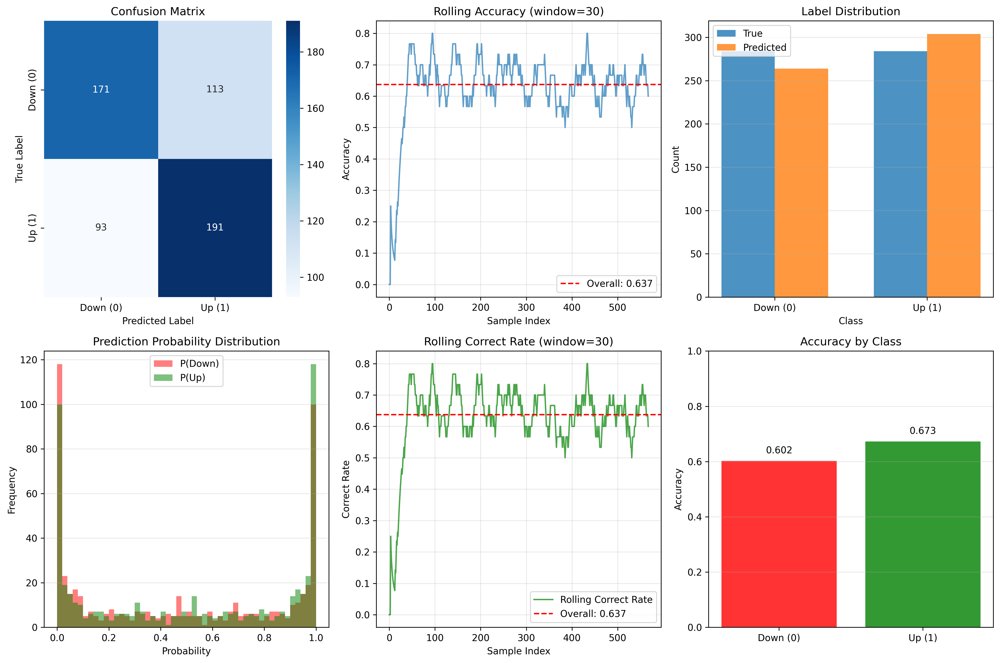
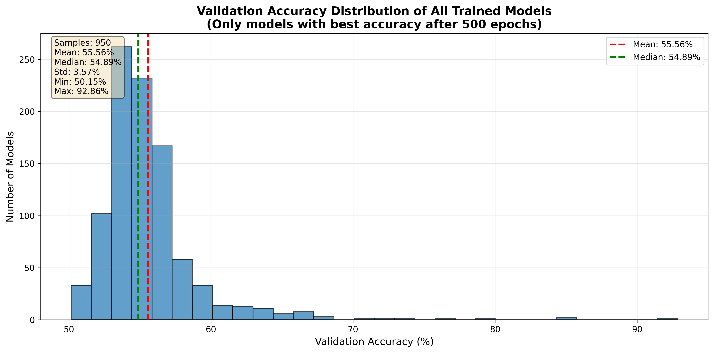

# 股票LSTM预测模型

基于LSTM神经网络的股票涨跌预测系统，支持任意股票的数据获取、预处理、训练和推理。

## 📊 推理结果可视化示例

下图展示了模型在验证集上的推理分析结果，包含多个维度的性能评估：



**图片说明**：

该可视化图表展示了LSTM模型在股票涨跌预测任务上的综合性能分析，包含以下6个子图：

1. **混淆矩阵（左上）**: 展示模型预测结果与真实标签的对比，用于评估分类准确性
2. **滚动准确率（中上）**: 显示模型在时间序列上的滚动窗口准确率变化趋势，帮助了解模型性能的稳定性
3. **标签分布（右上）**: 对比真实标签和预测标签的分布情况，检查预测是否平衡
4. **预测概率分布（左下）**: 展示模型对"涨"和"跌"两个类别的预测概率分布，反映模型的置信度
5. **滚动正确率（中下）**: 显示模型预测正确率的滚动窗口变化，用于识别模型性能波动
6. **按类别准确率（右下）**: 分别展示"涨"和"跌"两个类别的预测准确率，帮助发现模型是否存在类别偏向

**示例数据**：
- 股票代码: 518880（黄金ETF）
- 验证集样本数: 568
- 总体准确率: 63.73%
- 该结果展示了模型在实际应用中的表现

通过这个可视化分析，可以全面了解模型的预测性能、稳定性以及在不同类别上的表现差异。

## 📈 模型准确率统计

下图展示了所有训练模型的验证集准确率分布情况：



**图片说明**：

该直方图统计了所有训练完成的LSTM模型在验证集上的最佳准确率分布，包含以下信息：

1. **统计范围**: 仅统计最佳验证准确率出现在500个epoch之后的模型（排除早期过拟合的情况）
2. **样本数量**: 当前统计包含951个模型
3. **准确率分布**: 
   - 平均值: 55.56%
   - 中位数: 54.89%
   - 标准差: 3.57%
   - 范围: 50.15% - 92.86%
4. **分位数统计**:
   - 25%分位: 53.64%
   - 75%分位: 56.45%
   - 90%分位: 58.72%
   - 95%分位: 61.61%

**关键发现**：
- 大部分模型的验证准确率集中在53%-57%之间
- 中位数准确率约为54.89%，略高于随机猜测（50%）
- 有少数模型达到了较高的准确率（>60%），最高达到92.86%
- 红色虚线表示平均值，绿色虚线表示中位数

**使用方法**：

可以使用 `analyze_accuracy.py` 脚本重新生成此统计图表：

```bash
python analyze_accuracy.py --logs-dir logs --output docs/images/test_histogram.png
```

该脚本会自动分析 `logs/` 目录下所有训练模型的日志，提取验证集准确率并生成分布直方图。

## 📋 目录

- [功能特性](#功能特性)
- [项目结构](#项目结构)
- [安装说明](#安装说明)
- [快速开始](#快速开始)
- [配置说明](#配置说明)
- [使用指南](#使用指南)
- [数据管理](#数据管理)
- [常见问题](#常见问题)

## ✨ 功能特性

- **自动数据获取**: 支持ETF和普通股票数据自动获取（基于akshare）
- **数据预处理**: 自动进行数据归一化、序列化处理
- **数据平衡**: 自动将涨跌数据平衡至各50%，避免类别不平衡问题
- **模型训练**: 基于PyTorch的LSTM模型训练，支持GPU加速
- **模型推理**: 支持批量推理和结果可视化
- **完整日志**: 每次训练/推理自动保存详细日志和结果
- **灵活配置**: 通过YAML配置文件管理所有参数
- **数据清理**: 提供工具脚本批量清理训练任务数据

## 📁 项目结构

```
AKPRE_LSTM/
├── code/                      # 核心代码模块
│   ├── __init__.py
│   ├── data_fetcher.py       # 数据获取模块
│   ├── data_processor.py     # 数据预处理和序列化模块
│   ├── train_lstm.py         # 模型训练模块
│   └── inference.py          # 模型推理模块
├── config/                    # 配置文件目录
│   └── config.yaml           # 主配置文件
├── data/                      # 数据目录
│   ├── raw/                  # 原始数据（股票CSV文件）
│   └── processed/            # 处理后数据（序列化数据）
│       └── <股票码_日期>/    # 按股票和日期组织的处理数据
│           ├── train.csv     # 训练集
│           ├── train.npz     # 训练集（numpy格式）
│           ├── val.csv       # 验证集
│           └── val.npz       # 验证集（numpy格式）
├── logs/                      # 日志和模型目录
│   └── <日期时间>_<任务类型>_<股票码_日期>/
│       ├── best_model.pth   # 最佳模型
│       ├── train_info.json  # 训练信息
│       ├── training_curves.png  # 训练曲线
│       └── training.log      # 训练日志
├── checkpoint/               # 模型检查点目录（可选）
├── main.py                   # 主程序入口
├── cleanup_task.py           # 数据清理脚本
├── requirements.txt         # Python依赖
└── README.md                # 本文件
```

## 🚀 安装说明

### 环境要求

- Python >= 3.7
- CUDA（可选，用于GPU加速）

### 安装步骤

1. **克隆或下载项目**

```bash
cd /home/wxl/wxlcode/stock/AKPRE_LSTM
```

2. **安装依赖**

```bash
pip install -r requirements.txt
```

主要依赖包：
- `torch`: PyTorch深度学习框架
- `pandas`: 数据处理
- `numpy`: 数值计算
- `scikit-learn`: 机器学习工具
- `akshare`: 股票数据获取
- `matplotlib`, `seaborn`: 可视化
- `PyYAML`: 配置文件解析

## 🎯 快速开始

### 1. 训练模型

**步骤1**: 编辑配置文件 `config/config.yaml`

```yaml
mode: 'train'  # 设置为训练模式
stock:
  stock_code: "518880"  # 设置股票代码
  end_date: null  # null表示使用当前日期
```

**步骤2**: 运行训练

```bash
python main.py
```

程序会自动完成：
1. 获取股票数据（如果不存在）
2. 数据预处理和序列化
3. 数据平衡（涨跌各50%）
4. 模型训练
5. 保存模型和日志

### 2. 模型推理

**步骤1**: 编辑配置文件 `config/config.yaml`

```yaml
mode: 'inference'  # 设置为推理模式
inference:
  checkpoint_path: "logs/20251225_173526_train_518880_20251225/best_model.pth"
  data_path: "data/processed/518880_20251225/val.csv"
```

**步骤2**: 运行推理

```bash
python main.py
```

推理结果会保存在 `logs/` 目录下，包含：
- 推理结果CSV文件
- 可视化分析图表
- 统计信息JSON文件

## ⚙️ 配置说明

配置文件位于 `config/config.yaml`，主要配置项如下：

### 模式选择

```yaml
mode: 'train'  # 'train' 或 'inference'
```

### 股票配置

```yaml
stock:
  stock_code: "518880"      # 股票代码（ETF或股票）
  end_date: null            # 截止日期，null表示当前日期
```

### 数据配置

```yaml
data:
  sequence_length: 60        # 序列长度（默认60天）
  train_ratio: 0.8          # 训练集比例
  val_ratio: 0.2            # 验证集比例
  auto_fetch_data: true     # 是否自动获取数据
```

### 训练配置

```yaml
training:
  batch_size: 32            # 批次大小
  num_epochs: 100           # 训练周期数
  learning_rate: 0.001      # 学习率
  hidden_size: 128          # LSTM隐藏层大小
  early_stopping_patience: 30  # 早停耐心值
  random_seed: 42           # 随机种子
  use_gpu: true             # 是否使用GPU
```

### 推理配置

```yaml
inference:
  checkpoint_path: null     # 模型路径
  data_path: null           # 推理数据路径
  batch_size: 64           # 批次大小
  use_gpu: true            # 是否使用GPU
```

## 📖 使用指南

### 数据获取

数据获取模块支持：
- **ETF**: 使用 `fund_etf_hist_em` 接口
- **股票**: 使用 `stock_zh_a_hist` 接口

数据会自动保存到 `data/raw/<股票码_日期>.csv`

### 数据预处理

预处理流程：
1. 计算价格和成交量的百分比变化
2. Min-Max归一化
3. 生成涨跌标签（涨=1，跌=0）
4. 创建滑动窗口序列（默认60天）
5. **数据平衡**：将涨跌数据调整至各50%
6. 划分训练集和验证集

处理后的数据保存在 `data/processed/<股票码_日期>/`

### 模型训练

训练过程包括：
- 数据加载和标准化
- LSTM模型训练（3层LSTM + 全连接层）
- 早停机制（基于验证准确率）
- 学习率调度（ReduceLROnPlateau）
- 自动保存最佳模型

训练结果保存在 `logs/<日期时间>_train_<股票码_日期>/`

### 模型推理

推理功能包括：
- 批量预测
- 准确率计算（如果有标签）
- 混淆矩阵
- 可视化分析
- 结果保存

推理结果保存在 `logs/<日期时间>_inference_<股票码_日期>/`

## 🗑️ 数据管理

### 清理单个任务数据

使用 `cleanup_task.py` 脚本可以删除指定任务的所有相关数据：

```bash
# 预览模式（不实际删除）
python cleanup_task.py logs/20251225_173526_train_518880_20251225 --dry-run

# 实际删除（会询问确认）
python cleanup_task.py logs/20251225_173526_train_518880_20251225

# 不询问确认直接删除
python cleanup_task.py logs/20251225_173526_train_518880_20251225 --no-confirm
```

### 列出所有任务

```bash
python cleanup_task.py --list
```

### 批量删除

```bash
python cleanup_task.py logs/folder1 logs/folder2 --no-confirm
```

### 删除所有任务（危险操作）

```bash
python cleanup_task.py --all
```

**注意**: 清理脚本会删除：
- 日志文件夹（包含模型、训练曲线、日志）
- 原始数据文件（`data/raw/<股票码_日期>.csv`）
- 处理后数据文件夹（`data/processed/<股票码_日期>/`）

## 📊 模型架构

LSTM模型结构：
- **输入**: 60天的时间序列，每个时间步包含2个特征（收盘价归一化、成交量归一化）
- **Layer 1**: LSTM(128, return_sequences=True) + Dropout(0.2) + BatchNormalization
- **Layer 2**: LSTM(128, return_sequences=True) + Dropout(0.1)
- **Layer 3**: LSTM(128, return_sequences=False) + Dropout(0.2)
- **Layer 4**: Dense(32, activation='relu') + Dropout(0.2)
- **Layer 5**: Dense(2) - 输出涨跌二分类

## 🔍 常见问题

### 1. 数据获取失败

**问题**: 使用akshare获取数据时失败

**解决**:
- 检查网络连接
- 确认股票代码正确（ETF代码不带交易所后缀，如"518880"）
- 尝试更新akshare: `pip install --upgrade akshare`

### 2. GPU内存不足

**问题**: 训练时GPU内存溢出

**解决**:
- 减小 `batch_size`
- 在配置文件中设置 `use_gpu: false` 使用CPU
- 减小 `hidden_size`

### 3. 数据不平衡警告

**问题**: 数据平衡后样本数量大幅减少

**说明**: 这是正常现象，数据平衡会保留较少类别的全部样本，对较多类别进行下采样，确保两类各占50%。

### 4. 找不到模型文件

**问题**: 推理时提示模型文件不存在

**解决**:
- 检查 `checkpoint_path` 配置是否正确
- 使用绝对路径或相对于项目根目录的路径
- 确认模型文件确实存在

### 5. 训练准确率不理想

**建议**:
- 增加训练周期数
- 调整学习率
- 尝试不同的序列长度
- 检查数据质量

## 📝 文件命名规则

### 原始数据
- 格式: `<股票码>_<截止日期>.csv`
- 示例: `518880_20251225.csv`

### 处理后数据
- 目录: `data/processed/<股票码>_<截止日期>/`
- 文件: `train.csv`, `val.csv`, `train.npz`, `val.npz`

### 日志和模型
- 目录: `logs/<日期时间>_<任务类型>_<股票码>_<截止日期>/`
- 示例: `logs/20251225_173526_train_518880_20251225/`

## 🔧 高级用法

### 自定义序列长度

在 `config/config.yaml` 中修改：

```yaml
data:
  sequence_length: 30  # 改为30天
```

### 调整数据划分比例

```yaml
data:
  train_ratio: 0.7  # 训练集70%
  val_ratio: 0.3     # 验证集30%
```

### 使用不同的随机种子

```yaml
training:
  random_seed: 123  # 修改随机种子
```

## 📄 许可证

本项目仅供学习和研究使用。

## 🤝 贡献

欢迎提交Issue和Pull Request！

## 📧 联系方式

如有问题或建议，请通过Issue反馈。

---

**注意**: 
- 本模型仅用于学习和研究，不构成投资建议
- 股票投资有风险，请谨慎决策
- 模型预测结果仅供参考，不保证准确性

